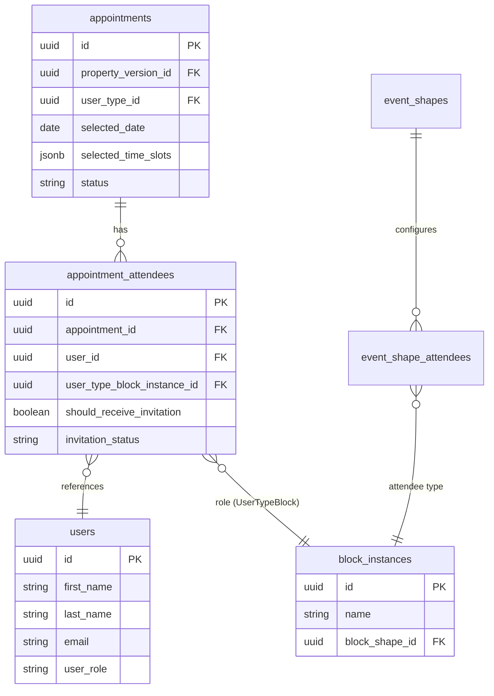
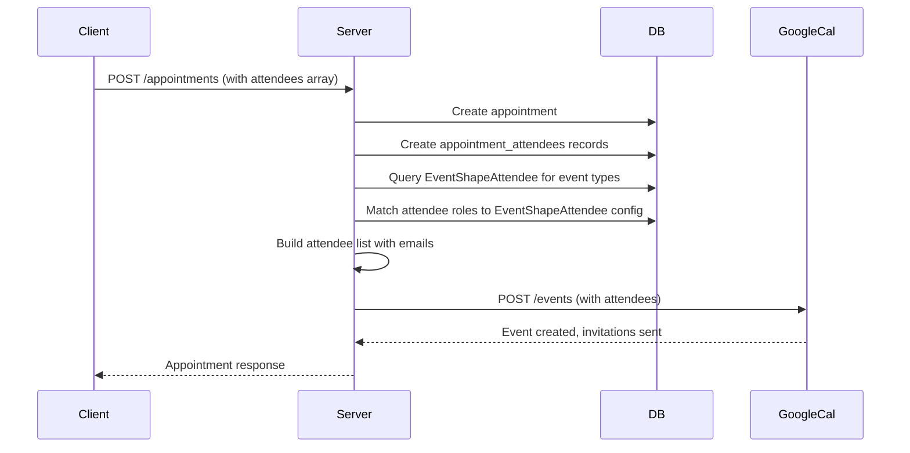

# Appointment Attendees Architecture Plan

## Problem Statement

Currently, appointments have hardcoded `clientId` and `agentId` fields that don't scale to multiple attendees and don't connect to the dynamic UserTypeBlock system. The `EventShapeAttendee` table defines which user types should attend events, but there's no clean way to link actual Users (with emails) to their roles for calendar invitations.

## Architecture Overview




## Data Flow for Calendar Invitations




---

## Phase 1: Database Schema

### 1.1 Create appointment_attendees Table

Create migration at [server/src/db/migrations/](server/src/db/migrations/):

```sql
CREATE TABLE appointment_attendees (
    id UUID PRIMARY KEY DEFAULT uuid_generate_v4(),
    appointment_id UUID NOT NULL REFERENCES appointments(id) ON DELETE CASCADE,
    user_id UUID NOT NULL REFERENCES users(id),
    user_type_block_instance_id UUID REFERENCES block_instances(id),
    should_receive_invitation BOOLEAN DEFAULT true,
    invitation_status VARCHAR(20) DEFAULT 'pending',
    google_event_id VARCHAR(255),
    created_at TIMESTAMP DEFAULT CURRENT_TIMESTAMP,
    updated_at TIMESTAMP DEFAULT CURRENT_TIMESTAMP,
    UNIQUE(appointment_id, user_id)
);

CREATE INDEX idx_appointment_attendees_appointment_id ON appointment_attendees(appointment_id);
CREATE INDEX idx_appointment_attendees_user_id ON appointment_attendees(user_id);
```

**Key columns:**

- `user_type_block_instance_id`: Links to UserTypeBlock (e.g., "Buyer", "Agent")
- `should_receive_invitation`: Admin can toggle per-attendee
- `invitation_status`: 'pending' | 'sent' | 'accepted' | 'declined' | 'failed'
- `google_event_id`: Store event ID for status tracking

### 1.2 Deprecate clientId/agentId

Add migration to mark columns as deprecated (keep for backward compatibility during transition):

```sql
COMMENT ON COLUMN appointments.client_id IS 'DEPRECATED: Use appointment_attendees table instead';
COMMENT ON COLUMN appointments.agent_id IS 'DEPRECATED: Use appointment_attendees table instead';
```

---

## Phase 2: Server Model and Relationships

### 2.1 Create AppointmentAttendee Model

Create [server/src/db/models/booking/appointment_attendee.ts](server/src/db/models/booking/appointment_attendee.ts):

```typescript
export class AppointmentAttendee extends Model {
  declare id: string;
  declare appointmentId: ForeignKey<string>;
  declare userId: ForeignKey<string>;
  declare userTypeBlockInstanceId: ForeignKey<string> | null;
  declare shouldReceiveInvitation: boolean;
  declare invitationStatus: 'pending' | 'sent' | 'accepted' | 'declined' | 'failed';
  declare googleEventId: string | null;
  
  declare user?: User;
  declare userTypeBlockInstance?: BlockInstance;
}
```

### 2.2 Update Model Index

Update [server/src/db/models/index.ts](server/src/db/models/index.ts):

- Import and initialize AppointmentAttendeeFactory
- Add relationships:
  - Appointment hasMany AppointmentAttendee
  - AppointmentAttendee belongsTo User
  - AppointmentAttendee belongsTo BlockInstance (userTypeBlockInstance)

---

## Phase 3: Server API Updates

### 3.1 Update Appointment Router

Modify [server/src/routes/internal/appointments/appointmentRouter.ts](server/src/routes/internal/appointments/appointmentRouter.ts):

**POST /appointments** changes:

1. Accept `attendees` array in request body:
  ```typescript
   interface AttendeeInput {
     userId: string;
     userTypeBlockInstanceId?: string;
     shouldReceiveInvitation?: boolean;
   }
  ```
2. After creating appointment, create AppointmentAttendee records
3. Include attendees in response

**GET /appointments/:id** changes:

- Include attendees with User relation (to get emails)

### 3.2 Create Calendar Event Integration

Add to appointment creation flow in router:

```typescript
// After creating appointment and attendees
if (appointment.status === 'submitted' || appointment.status === 'confirmed') {
  const attendeesWithEmails = await AppointmentAttendee.findAll({
    where: { appointmentId: appointment.id, shouldReceiveInvitation: true },
    include: [{ model: User, as: 'user' }]
  });
  
  const calendarAttendees = attendeesWithEmails.map(a => ({
    email: a.user.email,
    displayName: `${a.user.firstName} ${a.user.lastName}`
  }));
  
  const event = await createEvent({
    calendarId: 'scheduling@districthomepro.com',
    summary: buildEventSummary(appointment),
    location: buildEventLocation(appointment.propertyVersion),
    start: appointment.selectedDate + timeSlot,
    end: calculateEndTime(...),
    attendees: calendarAttendees,
    sendUpdates: 'all'
  });
  
  // Update attendees with event ID
  await AppointmentAttendee.update(
    { googleEventId: event.id, invitationStatus: 'sent' },
    { where: { appointmentId: appointment.id } }
  );
}
```

---

## Phase 4: Client Updates

### 4.1 Update Types

Update [client/src/types/appointment.ts](client/src/types/appointment.ts):

```typescript
interface AttendeeRequest {
  userId: string;
  userTypeBlockInstanceId?: string;
  shouldReceiveInvitation?: boolean;
}

interface AppointmentRequest {
  // ... existing fields
  attendees?: AttendeeRequest[];  // NEW
  clientId?: string;  // DEPRECATED
  agentId?: string;   // DEPRECATED
}
```

### 4.2 Update useAppointmentDataCollection

Modify [client/src/composables/booking/useAppointmentDataCollection.ts](client/src/composables/booking/useAppointmentDataCollection.ts):

Replace hardcoded clientId/agentId with attendees array:

```typescript
const attendees: AttendeeRequest[] = [
  { userId: clientId, userTypeBlockInstanceId: getBuyerTypeBlockId() },
  { userId: agentId, userTypeBlockInstanceId: getAgentTypeBlockId() },
];

// Add additional contacts to attendees
if (contacts.showAnotherClient) {
  attendees.push({ userId: anotherClientId, userTypeBlockInstanceId: getBuyerTypeBlockId() });
}
// ... etc

const appointmentData: AppointmentRequest = {
  // ... other fields
  attendees,  // Use new field
  // clientId, agentId removed
};
```

---

## Phase 5: UserTypeBlock Mapping

### 5.1 Bridge Hardcoded Roles to Dynamic UserTypeBlocks

The current system has hardcoded roles ('client', 'agent', etc.) but UserTypeBlocks are admin-configurable. Create a mapping utility:

```typescript
// server/src/utils/userTypeMapping.ts
export async function getUserTypeBlockIdForRole(role: string): Promise<string | null> {
  // Map hardcoded roles to UserTypeBlock names
  const roleToBlockName: Record<string, string> = {
    'client': 'Buyer',
    'agent': 'Agent', 
    'transaction_manager': 'Transaction Manager',
    'seller': 'Seller'
  };
  
  const blockName = roleToBlockName[role];
  if (!blockName) return null;
  
  const userTypeBlock = await BlockInstance.findOne({
    where: { name: blockName },
    include: [{ model: BlockShape, where: { isStateControl: true } }]
  });
  
  return userTypeBlock?.id || null;
}
```

---

## Phase 6: Data Migration

### 6.1 Migrate Existing Appointments

Create migration to populate appointment_attendees from existing clientId/agentId:

```javascript
// Migration: Populate appointment_attendees from existing data
async function up(queryInterface) {
  // Get all appointments with clientId or agentId
  const appointments = await queryInterface.sequelize.query(
    `SELECT id, client_id, agent_id FROM appointments WHERE client_id IS NOT NULL OR agent_id IS NOT NULL`
  );
  
  for (const appt of appointments[0]) {
    if (appt.client_id) {
      await queryInterface.bulkInsert('appointment_attendees', [{
        id: uuid(),
        appointment_id: appt.id,
        user_id: appt.client_id,
        user_type_block_instance_id: await getBuyerBlockId(),
        should_receive_invitation: true,
        invitation_status: 'pending'
      }]);
    }
    // Similar for agent_id
  }
}
```

---

## Files to Create


| File                                                                 | Purpose                               |
| -------------------------------------------------------------------- | ------------------------------------- |
| `server/src/db/migrations/YYYYMMDD_create_appointment_attendees.mjs` | Database migration                    |
| `server/src/db/models/booking/appointment_attendee.ts`               | Sequelize model                       |
| `server/src/utils/userTypeMapping.ts`                                | Role to UserTypeBlock mapping         |
| `server/src/services/appointmentCalendarService.ts`                  | Calendar integration for appointments |


## Files to Modify


| File                                                                                      | Changes                                           |
| ----------------------------------------------------------------------------------------- | ------------------------------------------------- |
| `server/src/db/models/index.ts`                                                           | Add AppointmentAttendee model and relationships   |
| `server/src/routes/internal/appointments/appointmentRouter.ts`                            | Handle attendees array, trigger calendar creation |
| `client/src/types/appointment.ts`                                                         | Add AttendeeRequest, deprecate clientId/agentId   |
| `client/src/composables/booking/useAppointmentDataCollection.ts`                          | Build attendees array instead of clientId/agentId |
| `.project-manager/features/feature-2-google-apis-integration/phases/phase-2.1-handoff.md` | Update session 2.1.3 scope                        |


---

## Success Criteria

- appointment_attendees table created and populated
- Appointments can be created with N attendees
- Each attendee linked to User (email) and UserTypeBlock (role)
- Calendar events created with correct attendees on appointment submission
- Invitation emails sent via Google Calendar
- invitation_status tracked per attendee
- Existing appointments migrated to new structure
- clientId/agentId deprecated but still functional during transition

