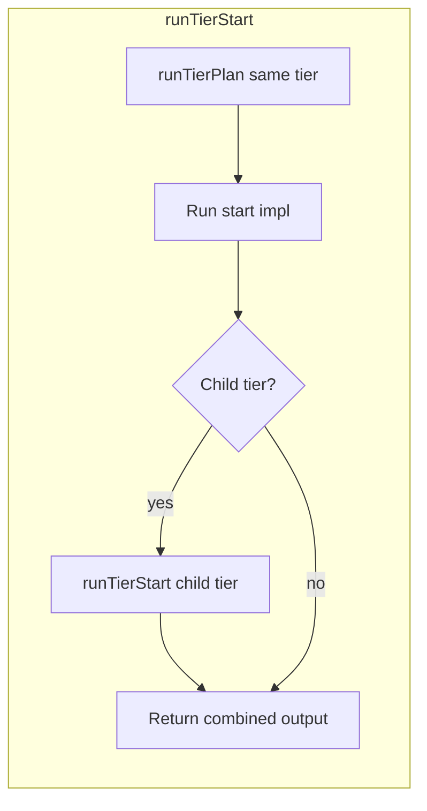

# Start includes plan + automatic tier-up / tier-down flow

## What went wrong

The **tier terminology and navigation** plan ([tier_terminology_and_navigation_493998f8.plan.md](/Users/districthomepro/.cursor/plans/tier_terminology_and_navigation_493998f8.plan.md)) explicitly said:

- Overview: "wire it into end/start flows so **next-step and optional automatic tier-up/tier-down movements** use one vocabulary."
- Section 4: "After a tier start, optionally **suggest or auto-start** the first unit at tierDown."
- Section 6 diagram: "**End flow**: when 'no next at tier', **suggest or run** tierUp end."

So the **intent** was automatic flow: run plan/start for child after start, run end for parent when no next at tier. What was **implemented** was only:

- The API: `tierUp`, `tierDown`, `getTierLevel` in `tier-navigation.ts`.
- Comments in end/start impls referencing tierUp/tierDown.
- **Suggestion text** in phase-start and session-start output ("To start the first session run /session-start …").
- **No** actual invocation of `runTierPlan` or `runTierStart` for the child tier.
- **No** actual invocation of `runTierEnd` for the parent when last at tier (session-end and phase-end only set `nextAction` text).

So the automatic up/down flow was never implemented. This plan fixes that and adds "start includes plan for same tier" in one place.

---

## Goals (all in scope)

1. **Start includes plan (same tier)**
  One start invocation runs **plan for that tier** then **start** for that tier. No separate `/plan-phase 4.1` before `/phase-start 4.1`.
2. **Tier-down cascade (after start)**
  After a successful start, **automatically** run **start for the child tier** (and append output). Start includes plan, so the child gets plan-then-start in one go. So: feature-start → phase-start (e.g. "1"); phase-start → session-start (first session); session-start → task-start (sessionId.1); task-start → no child.
3. **Tier-up cascade (at end)**
  When end determines "no next at tier," **optionally run** the parent-tier end (e.g. session-end when last session → run phase-end; phase-end when last phase → run feature-end) and combine outcomes, so the agent doesn’t have to run the next command manually. If that’s too big a behavior change in one step, we can document it and do "suggest" only for end in this plan and implement auto tier-up in a follow-up.

---

## Intended flow (diagram)

(Child runTierStart itself does plan-then-start for that tier, and may cascade to its child.)

- **End flow (tier-up):** When session-end (or phase-end) detects last at tier, run parent end and return combined result (or set nextAction to run it).

---

## Implementation plan

### 1. Same-tier plan then start (tier-start.ts)

- At the **start** of `runTierStart`, before the switch that calls the start impl:
  - From `params` derive **identifier** and **featureName** for the current tier (feature: featureName; phase: phase; session: sessionId; task: taskId; featureName from params or `WorkflowCommandContext.getCurrent()` where needed).
  - Call `runTierPlan(config, identifier, undefined, featureName)` and capture `planOutput`.
  - If plan throws: fail the whole start, or catch/log and continue without plan output (document choice).
- Run the existing start impl and capture `startOutput`.
- Proceed to step 2 (tier-down cascade); final return = planOutput + startOutput + (optional) child start output.

### 2. Tier-down cascade (tier-start.ts)

- After the start impl returns successfully, if current tier is **not** task:
  - `childTier = tierDown(config.name)`.
  - Resolve **child config** (map from TierName to TierConfig: FEATURE_CONFIG, PHASE_CONFIG, SESSION_CONFIG, TASK_CONFIG).
  - **Derive child start params (TierStartParams):**
    - feature → phase: `{ phase: "1" }` (first phase).
    - phase → session: read phase guide for first `Session X.Y.Z:`; params `{ sessionId, description?: string }` (description optional or from guide).
    - session → task: `{ taskId: sessionId + ".1", featureName?: string }` (featureName from context if needed).
  - Call **runTierStart(childConfig, childParams, options)**. That will run plan-then-start for the child (and may cascade to the child's child). On failure: log and append a short error line; do not fail the parent start.
  - Append child **start** output to the combined string (e.g. `\n---\n## Child tier start\n` + childOutput).
- Return: `planOutput + '\n---\n' + startOutput + (childStartOutput ?? '')`.

### 3. Tier-up cascade (session-end, phase-end)

- **session-end:** When `isLastSessionInPhase` and phase-end is the next step, instead of only setting `nextAction` to "suggest running /phase-end", **optionally** call `runTierEnd(PHASE_CONFIG, { phase })` and include that result in the outcome (e.g. combined output or structured outcome). Document: "nextAction = run phase-end" and agent can run it, or we run it and return combined.
- **phase-end:** Same for last phase → run `runTierEnd(FEATURE_CONFIG, params)` and combine.
- **Decision:** Either implement auto tier-up in this plan (run parent end and return combined) or keep current "suggest" behavior and add a follow-up todo for auto tier-up. Plan should state which.

### 4. Child start-params helper

- Add a small helper (e.g. in tier-start or utils): given current tier and start params, return **TierStartParams** for the **child** tier (for phase→session, async: read phase guide to get first session ID). Return `null` to skip cascade (e.g. no phase guide or no session match). So: feature→phase returns `{ phase: "1" }`; phase→session returns `{ sessionId, description? }`; session→task returns `{ taskId: sessionId+".1", featureName? }`.

### 5. Config map

- In tier-start.ts (or shared), map `TierName` → `TierConfig` so after `tierDown(config.name)` we have the child config for `runTierStart`.

### 6. Simplify start impl output

- Remove or shorten in start impls:
  - Redundant "Use `/plan-session`" / "Use `/plan-task`" (same tier is now covered by "start includes plan").
  - Redundant "tierDown: To start the first session run …" now that we auto-run start for child (cascade is the source of truth).
- Keep mode/approval workflow text.

### 7. Documentation

- START_END_PLAYBOOK_STRUCTURE.md: Start includes plan for same tier; after start, **start** for child tier runs automatically (tier-down), so child gets plan+start; at end when no next at tier, next step is tier-up end (and optionally we run it automatically).

---

## Files to touch

| File                                                                                                                             | Change                                                                                                                                                                                                                                                         |
| -------------------------------------------------------------------------------------------------------------------------------- | -------------------------------------------------------------------------------------------------------------------------------------------------------------------------------------------------------------------------------------------------------------- |
| [.cursor/commands/tiers/shared/tier-start.ts](.cursor/commands/tiers/shared/tier-start.ts)                                       | 1) Run runTierPlan for current tier first. 2) Run start impl. 3) If child tier, derive child params, run runTierStart(childConfig, childParams, options), append output. Return combined string. Add config map and child-params helper (or import from util). |
| [.cursor/commands/utils/](.cursor/commands/utils/)                                                                               | Optional: new helper to derive child TierStartParams (phase→session from phase guide, session→task sessionId+".1", feature→phase "1").                                                                                                                         |
| [.cursor/commands/tiers/feature/composite/feature-start-impl.ts](.cursor/commands/tiers/feature/composite/feature-start-impl.ts) | Simplify Next Steps (plan first phase is now automatic).                                                                                                                                                                                                       |
| [.cursor/commands/tiers/phase/composite/phase-start-impl.ts](.cursor/commands/tiers/phase/composite/phase-start-impl.ts)         | Remove/shorten "Use `/plan-session`" and redundant tierDown suggestion text.                                                                                                                                                                                   |
| [.cursor/commands/tiers/session/composite/session-start-impl.ts](.cursor/commands/tiers/session/composite/session-start-impl.ts) | Remove/shorten "Use `/plan-task`" and redundant tierDown suggestion text.                                                                                                                                                                                      |
| [.cursor/commands/tiers/session/composite/session-end-impl.ts](.cursor/commands/tiers/session/composite/session-end-impl.ts)     | Optional: when last session, call runTierEnd(PHASE_CONFIG, …) and combine with session-end outcome.                                                                                                                                                            |
| [.cursor/commands/tiers/phase/composite/phase-end-impl.ts](.cursor/commands/tiers/phase/composite/phase-end-impl.ts)             | Optional: when last phase, call runTierEnd(FEATURE_CONFIG, …) and combine.                                                                                                                                                                                     |
| [.cursor/commands/tiers/START_END_PLAYBOOK_STRUCTURE.md](.cursor/commands/tiers/START_END_PLAYBOOK_STRUCTURE.md)                 | Document: start = plan same tier + start + auto start child (child gets plan+start); end = when no next, tier-up end (suggest or run).                                                                                                                         |

---

## Verification

- `/phase-start 4.1`: output includes plan-phase 4.1, then phase-start 4.1, then **session-start** for first session in phase (which itself includes plan-session + session-start; if phase guide has sessions).
- `/session-start 4.1.1 "Name"`: output includes plan-session, session-start, then **task-start** for 4.1.1.1 (plan-task + task-start).
- `/task-start 4.1.1.1`: output includes plan-task, task-start; no child.
- `/feature-start my-feature`: output includes plan-feature, feature-start, then **phase-start** for phase "1" (plan-phase + phase-start).
- Session-end when last session: either nextAction tells agent to run phase-end, or we run phase-end and return combined (per implementation decision above).

